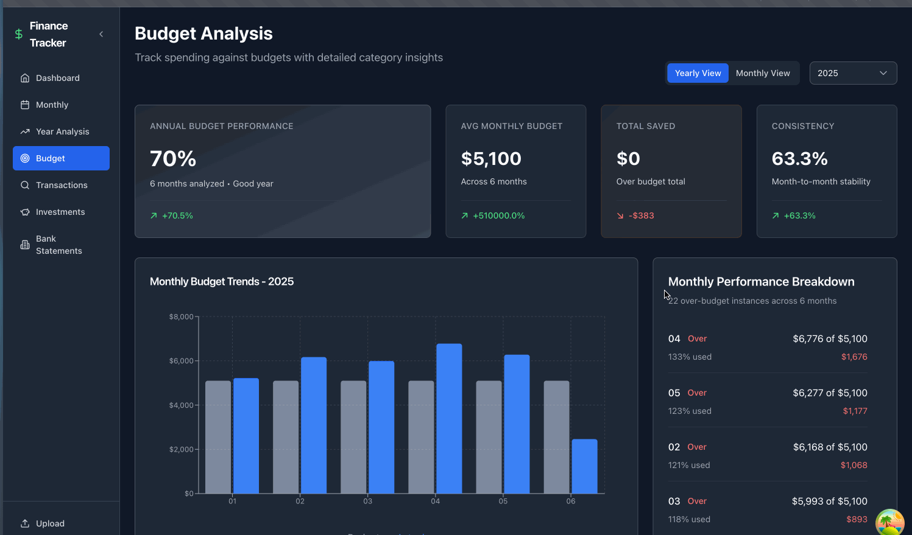

# Personal Finance Dashboard 📊

> A comprehensive full-stack financial analytics platform featuring transaction categorization, investment portfolio tracking, budget analysis, and OCR-powered statement processing.

## 🎥 Live Demo

### Dashboard Overview

*Complete financial overview with portfolio tracking and budget analysis*

### Portfolio Performance

*Investment tracking across 7 accounts with 3 years of growth data*

### Transaction Management

*Browse and filter 1,800+ categorized transactions*

### File Upload & Processing

*OCR-powered statement processing with duplicate detection*

### Budget Analysis

*Real-time budget vs. actual spending with visual alerts*

## 🚀 One-Click Demo Setup

Get a complete financial dashboard running in 30 seconds:

```bash
git clone https://github.com/yourusername/PersonalFinancesPublic
cd PersonalFinancesPublic
python demo_setup.py
```

**That's it!** The script will:
- Install all dependencies (Python + Node.js)
- Generate 3 years of realistic demo data (2023-2025)
- Create a $200K+ portfolio with 1,800+ transactions
- Start both backend and frontend servers
- Open your browser to the dashboard


## 🎥 What You'll See

### 📊 Complete Financial Dashboard
- **$200,000+ investment portfolio** across 7 real account types
- **1,800+ categorized transactions** spanning 36 months
- **Budget vs. actual analysis** with visual indicators
- **Investment performance tracking** with growth attribution
- **Bank account monitoring** (Wells Fargo integration)

### 💼 Professional Features
- **Real-time API** with auto-generated documentation
- **OCR statement processing** (upload PDF bank statements)
- **Smart duplicate detection** prevents data errors
- **Advanced analytics** with spending patterns and trends
- **Responsive design** works on desktop and mobile


## 🧪 Testing the Demo

### 1. **Explore the Dashboard**
- **Overview Page**: See your complete financial picture
- **Transactions**: Browse 1,800+ categorized transactions
- **Portfolio**: Track $200K across Wealthfront, Schwab, Acorns, Robinhood, 401k, Roth IRA
- **Budget Analysis**: View spending vs. budget with alerts
- **Bank Accounts**: Monitor Wells Fargo checking/savings balances

### 2. **Test File Upload Features**
Navigate to the upload section and try these sample files (included in the repo):

#### CSV Transaction Imports
- `demo/sample_files/wells_fargo_demo_transactions.csv` - Standard bank export
- `demo/sample_files/duplicate_test_transactions.csv` - Test duplicate detection
- `demo/sample_files/demo_bank_export.csv` - Alternative format testing

#### PDF Statement Processing (OCR)
- `demo/sample_files/wells_fargo_demo_statement.pdf` - Bank statement OCR
- `demo/sample_files/wealthfront_demo_statement.pdf` - Investment statement OCR


### 3. **API Exploration**
Visit the auto-generated API documentation:
- **Backend API**: `http://localhost:8000/docs`
- **Interactive testing** of all endpoints
- **Real-time data** from your demo database

### 4. **Advanced Features**
- **Budget Alerts**: See which categories are over/under budget
- **Investment Analytics**: Track portfolio performance and allocation
- **Spending Patterns**: Identify trends and insights
- **Monthly Reports**: Comprehensive financial summaries


## 🛠 Tech Stack

| Component | Technology | Purpose |
|-----------|------------|---------|
| **Backend** | Python 3.12, FastAPI | REST API with auto-documentation |
| **Database** | SQLAlchemy, SQLite | Robust financial data modeling |
| **Frontend** | React 18, TypeScript | Type-safe, responsive UI |
| **Styling** | Tailwind CSS | Modern, consistent design |
| **State Management** | TanStack Query | Efficient API state management |
| **Data Processing** | Pandas, PDF parsing | Transaction import and OCR |
| **Charts** | Recharts | Interactive financial visualizations |

## 📁 Project Architecture

```
PersonalFinancesPublic/
├── 📱 Frontend (React + TypeScript)
│   ├── finance-dashboard/src/
│   │   ├── components/          # Reusable UI components
│   │   ├── services/           # API integration layer
│   │   ├── types/              # TypeScript definitions
│   │   └── utils/              # Helper functions
│   
├── ⚙️ Backend (Python + FastAPI)
│   ├── src/
│   │   ├── api/                # FastAPI routes and schemas
│   │   ├── models/             # Database models
│   │   ├── services/           # Business logic
│   │   ├── repositories/       # Data access layer
│   │   └── utils/              # Utility functions
│   
├── 🎭 Demo System
│   ├── demo/
│   │   ├── data_generator/     # Realistic data generation
│   │   └── sample_files/       # Upload testing files
│   ├── demo_setup.py          # One-click setup script
│   └── test.py                # Demo database creator
│   
├── ⚙️ Configuration
│   ├── config.demo.yaml       # Demo app configuration
│   ├── database.py            # Database setup
│   └── requirements.txt       # Python dependencies
│   
└── 📖 Documentation
    ├── README.md              # This file
    └── docs/                  # Screenshots and guides
```

## 💳 Demo Data Overview

### Financial Profile
- **Total Portfolio Value**: $200,000+ (realistic growth 2023-2025)
- **Monthly Income**: $6,000 (biweekly salary + quarterly bonuses)
- **Monthly Expenses**: ~$4,200 (rent, food, transportation, etc.)
- **Savings Rate**: 47% (impressive but achievable)
- **Investment Allocation**: Diversified across 7 account types

### Account Breakdown
| Account | Institution | Type | Allocation | Demo Value |
|---------|------------|------|------------|------------|
| Wealthfront Investment | Wealthfront | Brokerage | 37.5% | ~$75K |
| Schwab Brokerage | Charles Schwab | Brokerage | 22.5% | ~$45K |
| 401(k) Plan | ADP | Retirement | 17.5% | ~$35K |
| Robinhood | Robinhood | Brokerage | 10.0% | ~$20K |
| Acorns | Acorns | Micro-investing | 7.5% | ~$15K |
| Roth IRA | Charles Schwab | Retirement | 4.0% | ~$8K |
| Wealthfront Cash | Wealthfront | Cash | 1.0% | ~$2K |

### Transaction Categories
- **Housing**: $2,400/month (rent payments)
- **Food**: $800/month (groceries + restaurants)
- **Transportation**: $300/month (gas, rideshare)
- **Investment**: $1,400/month (regular transfers)
- **Utilities**: $250/month (phone, internet, electric)
- **Entertainment**: $150/month (streaming, events)
- **Healthcare**: $200/month (insurance, medical)
- **Shopping**: $400/month (general purchases)


## 🚀 Manual Setup (Alternative)

If you prefer step-by-step setup:

### Backend
```bash
# Install Python dependencies
pip install -r requirements.txt

# Generate demo database
python test.py

# Start API server
python run_api.py
```

### Frontend
```bash
# Install Node.js dependencies
cd finance-dashboard
npm install

# Start development server
npm start
```

### Access Points
- **Frontend Dashboard**: http://localhost:3000
- **Backend API**: http://localhost:8000
- **API Documentation**: http://localhost:8000/docs

## 🎯 Key Features Demonstrated

### 💰 Transaction Management
- **Automatic Categorization**: 15+ spending categories with keyword matching
- **Duplicate Detection**: Smart prevention of duplicate entries
- **Bulk Import**: CSV file processing with validation
- **Manual Entry**: Add individual transactions with validation

### 📈 Investment Portfolio
- **Multi-Account Tracking**: 7 different account types
- **Performance Analytics**: Growth attribution (market vs. deposits)
- **Historical Data**: 36 months of balance snapshots
- **Institution Breakdown**: Analyze by brokerage/institution

### 📊 Budget & Analytics
- **Budget vs. Actual**: Visual comparison with alerts
- **Spending Patterns**: Identify trends and outliers
- **Monthly Reports**: Comprehensive financial summaries
- **Year-over-Year**: Compare financial progress

### 🏦 Bank Integration
- **Account Monitoring**: Checking and savings balances
- **Statement Processing**: OCR extraction from PDF statements
- **Balance Tracking**: Historical balance trends
- **Deposit/Withdrawal Analysis**: Cash flow patterns

### 📄 Document Processing
- **PDF OCR**: Extract data from bank/investment statements
- **Multiple Formats**: Support for various bank export formats
- **Error Handling**: Graceful handling of processing failures
- **Review Workflow**: Manual verification of extracted data

## 💼 Professional Highlights

This project demonstrates:

### Full-Stack Development
- **Modern Tech Stack**: React, TypeScript, FastAPI, SQLAlchemy
- **Clean Architecture**: Separation of concerns, dependency injection
- **Type Safety**: End-to-end TypeScript + Pydantic validation
- **Error Handling**: Comprehensive error management and user feedback

### Financial Domain Expertise
- **Complex Data Modeling**: Multi-table relationships, financial calculations
- **Regulatory Awareness**: Data privacy and financial data security
- **Business Logic**: Investment tracking, budget analysis, cash flow
- **User Experience**: Intuitive financial dashboard design

### Data Engineering
- **ETL Pipelines**: Transaction import and processing
- **OCR Integration**: PDF statement parsing
- **Data Validation**: Duplicate detection and data integrity
- **Performance**: Efficient queries and data aggregation

### DevOps & Deployment
- **Containerization Ready**: Docker-friendly structure
- **Environment Management**: Development vs. production configs
- **Documentation**: Comprehensive setup and usage guides
- **Demo System**: One-click demonstration environment

## 📸 Screenshots & Demos

### Creating Screenshots
To document your demo, take these key screenshots:

1. **Dashboard Overview** (`dashboard-overview.png`)
   - Full dashboard with all widgets visible
   - Show portfolio value, recent transactions, budget status

2. **Portfolio Performance** (`portfolio-performance.png`)
   - Portfolio trends chart over 3 years
   - Account allocation pie chart
   - Growth attribution analysis

3. **Transaction Management** (`transaction-management.png`)
   - Transaction list with filters applied
   - Category breakdown
   - Search/sort functionality

4. **Budget Analysis** (`budget-comparison.png`)
   - Budget vs. actual spending chart
   - Category-wise budget performance
   - Alert indicators for over-budget items

5. **File Upload Demo** (`file-upload-demo.png`)
   - Upload interface with sample files
   - Processing results
   - Duplicate detection warnings

6. **Investment Analytics** (`investment-analytics.png`)
   - Individual account performance
   - Institution comparison
   - Monthly contribution tracking

### Adding Screenshots
1. Create a `docs/screenshots/` directory
2. Take screenshots at 1920x1080 resolution
3. Save as PNG files with descriptive names
4. Reference them in README with relative paths:
   ```markdown
   
   ```

## 🔧 Customization

### Modify Demo Data
Edit `demo/data_generator/demo_data_generator.py` to customize:
- Transaction amounts and patterns
- Portfolio allocation and growth
- Account types and institutions
- Time periods and frequency

### Extend Functionality
The modular architecture makes it easy to add:
- New financial institutions
- Additional transaction categories
- Advanced analytics features
- Integration with external APIs

### Configuration
Update `config.demo.yaml` to modify:
- Category definitions and keywords
- Budget amounts and targets
- Account configurations
- File processing settings

## 🤝 Contributing

This is a demonstration repository showcasing a personal finance management system. While this is primarily for portfolio demonstration, suggestions and feedback are welcome!

### Areas for Enhancement
- Additional financial institution integrations
- Advanced investment analytics
- Mobile app development
- Automated transaction categorization using ML
- Goals and forecasting features

## 📄 License

MIT License - see [LICENSE](LICENSE) file for details.

## 🎯 Use Cases

Perfect for demonstrating:

### For Employers
- **Full-stack development** capabilities
- **Financial domain** knowledge and experience
- **Complex data modeling** and business logic
- **Modern development** practices and tools

### For Learning
- **React + TypeScript** frontend development
- **FastAPI + SQLAlchemy** backend architecture
- **Financial data** processing and analysis
- **OCR and document** processing techniques

### For Extension
- **Personal finance** management foundation
- **Multi-tenant SaaS** application base
- **Financial planning** tool development
- **Investment tracking** system

---

## 🚀 Ready to Explore?

**Start the demo and discover a comprehensive financial management platform built with modern technologies and best practices!**

```bash
python demo_setup.py
```

**Visit http://localhost:3000 and start exploring your $200K+ portfolio with 3 years of realistic financial data!**

---

*Built with ❤️ using React, TypeScript, FastAPI, and modern development practices. All demo data is synthetic and generated for demonstration purposes.*